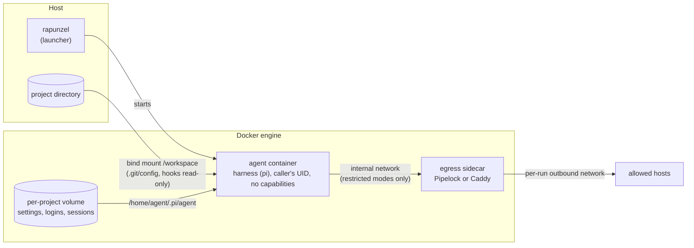

# rapunzel: Architecture

## Abstract

rapunzel runs coding-agent harnesses inside a Docker container that treats the agent as untrusted.
A harness is the command-line agent that drives a model and acts on a project, such as pi or Claude Code.
The pi coding agent is the first supported harness; Claude Code, Codex CLI, and Copilot CLI are planned as further profiles.
The agent sees one host directory, the project it works on, and keeps its own settings, logins, and sessions in a separate Docker volume per project.
It runs as the caller's user without root privileges or Linux capabilities, and receives only an allowlist of environment variables.
Two optional egress modes restrict the network: `allowlist` lets the agent reach only named hosts through an SNI-checking HTTPS proxy, and `strict` additionally keeps provider API keys out of the container by placing them in a credential gateway.
Because an agent can also attack the host indirectly, by writing files that the host later runs, git hooks and git configuration are mounted read-only and changes to other host-executed files are reported after each run.
Every one of these properties is checked by scripts that act as a hostile agent through the real launcher; they run in CI before any image is published.

## Key points

1. **The boundary is outside the agent.** rapunzel does not rely on the agent's own permission prompts or sandbox. Docker, the launcher, and sidecar containers enforce every control, whichever harness runs inside.
2. **One host directory, nothing else.** The project is mounted at `/workspace`. The host home directory, `~/.pi`, `~/.ssh`, and the Docker socket are never mounted. Agent state lives in a per-project named volume.
3. **No privileges.** The agent runs as the caller's numeric UID and GID, with all capabilities dropped and `no-new-privileges` set.
4. **Network access is a choice.** `open` (default) gives normal internet access. `allowlist` gives only named HTTPS hosts. `strict` gives only fixed provider routes and no real API key.
5. **The network boundary fails closed.** In both restricted modes the agent sits on a Docker `--internal` network with no route, no external DNS, and no host address. Anything that ignores the proxy has nowhere to go.
6. **The host is protected from planted files.** Git hooks and git configuration are read-only inside the container, so the agent cannot make the host's git run its code. Other host-executed files are reported, not blocked.
7. **Claims are tested, not assumed.** `verify-isolation.sh`, `verify-host-files.sh`, and `verify-egress.sh` probe the boundary from inside the container. CI runs them on every change and before every image release.

## 1 Problem and goals

Coding agents read and write source code, run shell commands, install packages, and talk to model APIs.
They act on instructions that may come from the files they read, so a prompt injection in a dependency's README can turn a helpful agent into a hostile one.
Running such an agent directly on a workstation gives it everything the user has: SSH keys, cloud credentials, browser sessions, other projects, and the local network.

rapunzel aims for the following:

| Goal | Meaning |
|---|---|
| G1: Confinement | The agent can read and write only the project it was started for. |
| G2: No ambient secrets | Host credentials and environment variables do not leak into the container. Only explicitly configured provider settings do. |
| G3: Controlled egress | The user can restrict where the agent connects, up to keeping the provider key itself out of reach. |
| G4: Host integrity | Files the agent writes in the project cannot silently run on the host later. |
| G5: Portability | The same behavior on Linux, Docker Desktop for macOS, Colima, and WSL2. |
| G6: Verifiability | Every isolation claim has an automated check. |

Non-goals: protecting the project's contents from the agent (the agent is meant to edit them), and protecting data the agent legitimately sends to its model provider.

## 2 Threat model

**Trusted:** the host, the Docker engine, the launcher scripts in this repository, and the pinned container images.

**Untrusted:** the agent process, every process it starts, the content of the mounted project, and everything stored in the agent's volume, including its settings, extensions, and logins.

**The attacker** controls the agent, for example through prompt injection, and tries to:

- read host files or credentials outside the project;
- send data to a server of its choice;
- reach the host or the local network;
- gain root or Linux capabilities inside the container;
- plant code that the host runs later, outside the container;
- persist across sessions through the agent's volume.

**Out of scope:** kernel or container-runtime escapes, a compromised Docker engine or host, and the model provider itself.

## 3 System overview



| Component | Role | Source |
|---|---|---|
| `rapunzel` | Launcher on the host. Builds the `docker run` command, filters the environment, sets up egress, reports host-file changes, resets the terminal. | `rapunzel`, `lib/*.sh` |
| Image | Debian slim with Node 24, git, ripgrep, and the pi harness. Built from this repository and published to `ghcr.io/koopycat/rapunzel`. | `Dockerfile` |
| Entrypoint | Maps the caller's UID to the name `agent`, writes pi's configuration, then runs the requested command. | `bootstrap.sh`, `setup-identity.sh`, `profiles/<harness>/bootstrap.mjs` |
| Agent volume | Docker named volume per project, mounted at `/home/agent/.pi/agent`. | `lib/volumes.sh` |
| Egress sidecar | Pipelock (allowlist mode) or Caddy (strict mode), created per run. | `lib/egress.sh` |
| `rapunzel-ext` | Copies curated extensions from the host into a project's volume. | `rapunzel-ext` |
| Check scripts | Probe the boundary from inside the container. | `test.sh`, `verify-*.sh` |

**One run, step by step:**

1. `rapunzel` resolves the project directory (default: the current directory) and refuses to run as root.
2. It checks that the Docker engine is reachable and explains how to start one if not.
3. It prepares the volume's ownership for the caller's UID in a short-lived, networkless container.
4. It filters the environment and the optional env file through an allowlist.
5. In a restricted egress mode it creates two networks and the sidecar, and waits until the sidecar is healthy.
6. It records hashes of host-executed files in the project.
7. It runs the agent container. The entrypoint sets up the identity and pi's configuration, then starts the harness, pi.
8. When the harness exits, it reports changed host-executed files, removes the sidecar and networks, and resets terminal modes the harness may have left on.

## 4 Design

### 4.1 Process and filesystem isolation

The agent container starts with `--user <caller UID>:<caller GID>`, `--cap-drop=ALL`, `--security-opt=no-new-privileges`, and `--init`.
It has exactly two intentional mounts:

```text
PROJECT_DIR (read-write)   -> /workspace
per-project named volume   -> /home/agent/.pi/agent
```

The project mount uses the caller's own UID, so files the agent creates belong to the user on the host.
Nothing else from the host is mounted.
In particular the host `~/.pi` stays out: it holds credentials, trust decisions, extensions that run code, and full session history from every project.

### 4.2 Identity without root

The container runs as an arbitrary UID that has no entry in `/etc/passwd`, which breaks shell prompts, `whoami`, and Node's `os.userInfo()`.
Adding an entry would need root at runtime.
Instead, `setup-identity.sh` writes a private passwd and group file into the agent volume and preloads libnss-wrapper, which maps the current UID to the name `agent`.
`LD_PRELOAD` is always set to exactly that library; an inherited value is discarded.

`/home/agent` and `/home/agent/.pi` are world-writable with the sticky bit, like `/tmp`, because the runtime UID is the caller's and not the image's build user.
Tools and extensions write caches there, for example `~/.pi/cache`.
The image also marks `/workspace` as a safe git directory, because Docker Desktop presents the mount root as owned by root and git would otherwise refuse the repository.

### 4.3 Agent state and configuration

Each project gets its own volume, named `rapunzel-<harness>-` plus the first 12 hex digits of the SHA-256 of its canonical path.
Settings, `/login` credentials, sessions, trust decisions, and installed extensions therefore never mix between projects.

A new volume is owned by root.
Before every run, a short root container with only `CHOWN` and `DAC_OVERRIDE`, and no network, hands it to the caller's UID.
A marker file records the owner, so later runs only read it.

The entrypoint rewrites pi's `models.json` and `settings.json` on every start.
It registers a custom provider from `RAPUNZEL_*` variables, points built-in providers at the credential gateway in strict mode, and removes those overrides again in other modes.
Because these entries are rewritten each time, an edit the agent makes to them does not persist.

### 4.4 Environment and credentials

The container never inherits the host environment.
`rapunzel` forwards only names on an allowlist: known provider keys, `RAPUNZEL_*` provider settings, proxy variables, and a few pi switches.
A denylist (`LD_PRELOAD`, `NODE_OPTIONS`, `BASH_ENV`, `PATH`, `HOME`, and similar) wins over everything, so neither the host nor an env file can inject loader or interpreter hooks.
`RAPUNZEL_ENV_FILE` passes through the same filter; dropped names are reported.

Secrets reach the container only at runtime, never through the image.
How far they reach depends on the egress mode (section 4.5): in `open` and `allowlist` the agent holds the key it uses; in `strict` it holds a placeholder.

### 4.5 Network egress

`RAPUNZEL_EGRESS` selects one of three modes.

| Mode | Agent holds the provider credential | Agent can reach |
|---|---|---|
| `open` (default) | yes | the internet through Docker's `bridge` network |
| `allowlist` | yes | only allowlisted hosts over HTTPS |
| `strict` | no, only a placeholder | only fixed provider routes on a credential gateway |

**The network layer.**
Both restricted modes create two networks per run.
The agent joins only the first: an `--internal` network in isolated gateway mode (Docker Engine 28 or newer).
It has no route off the network, no external DNS, and no address on the host side of the bridge.
The sidecar joins this network and a second, per-run outbound bridge.
It never joins Docker's default bridge, so even a compromised sidecar cannot reach the user's other containers.
Isolated gateway mode is not optional: in testing, a listener on the host network was reachable from a plain internal network.

**allowlist mode.**
The sidecar is [Pipelock](https://github.com/luckyPipewrench/pipelock) acting as an HTTPS CONNECT proxy.
The agent gets `HTTPS_PROXY` and `NODE_USE_ENV_PROXY=1`, and no `HTTP_PROXY`, so cleartext requests fail.
For every tunnel, Pipelock checks the requested host against the allowlist, requires the TLS ClientHello's server name (SNI) to match it, resolves the name itself, and refuses private, loopback, link-local, and metadata addresses.
The SNI check matters: without it, a tunnel to an allowed host on a shared CDN can reach any other site on that CDN.
Squid and Smokescreen failed exactly this test.

The allowlist is built only from settings on the host:

| Setting | Allowed host |
|---|---|
| `ANTHROPIC_API_KEY`, `OPENAI_API_KEY` | `api.anthropic.com`, `api.openai.com` |
| `RAPUNZEL_API_BASE_URL` | that URL's host |
| `RAPUNZEL_EGRESS_LOGINS` | model API and token refresh hosts of named `/login` providers |
| `RAPUNZEL_EGRESS_ALLOW` | listed hosts; `*.example.com` also matches `example.com` |
| `RAPUNZEL_EGRESS_ALLOW_PRIVATE` | exact hosts that may resolve to private addresses, such as a model router on the LAN |

It is never read from `auth.json` or anything else in the volume, because the agent can write there and would otherwise choose its own allowlist.

**strict mode.**
The sidecar is a Caddy reverse proxy that holds the real keys.
The bootstrap points pi's providers at `http://llm-proxy:8080`, and the agent holds the placeholder `rapunzel-gateway`.
Caddy forwards only `/anthropic`, `/openai`, and `/custom` to fixed upstreams, always overwrites the auth headers with the real key, and answers everything else with 403.
Overwriting rather than swapping a placeholder matters: it stops the agent from using an allowed provider with an attacker's key to send data out.
OAuth logins cannot use this mode, because pi refreshes those tokens itself and keeps them in the volume.

**Extension providers.**
A provider can come from a pi extension that reads its own variables, for example `OMNIROUTE_BASE_URL` and `OMNIROUTE_API_KEY`.
`RAPUNZEL_BASE_URL_VARIABLE` and `RAPUNZEL_API_KEY_VARIABLE` name them.
`rapunzel` fills in the real URL and key in `open` and `allowlist` mode, and the gateway route and placeholder in `strict` mode.

The full reasoning, including rejected alternatives and test evidence, is in [Egress control: architecture and decisions](egress.md).

### 4.6 Files the host runs

Network controls do not help if the agent writes a git hook and the user then runs `git commit` on the host.
rapunzel handles this in two layers.

**Prevention for git.**
`.git/config`, `.git/hooks`, and a `core.hooksPath` directory inside the project (such as `.husky`) are mounted read-only on top of the project mount.
The agent can still commit, branch, and stash; it cannot add a hook, set `core.fsmonitor`, or change `core.hooksPath`.
Linked worktrees and submodules keep their git directory outside the project, so it is not mounted at all.

**Detection for everything else.**
Before the agent starts, `rapunzel` hashes files that common host tools run on their own: `.envrc`, editor tasks and settings, devcontainer and CI configuration, pre-commit and husky hooks, agent settings, package manifests and scripts, Makefiles, Nix and devenv files, and the writable parts of `.git`.
When the agent exits, it lists every such file that was added, modified, or removed.

The trade-off is deliberate: making the whole `.git` read-only would stop the agent from committing, and a clone-based workspace is a larger change (section 8).

### 4.7 Operational details

- **Docker reachability.** All scripts check that the Docker engine responds before their first Docker call. If not, they print the original error, the active context or `DOCKER_HOST`, and how to start an engine or switch contexts.
- **Terminal reset.** pi switches on the kitty keyboard protocol, mouse and focus reporting, and since version 1.0 a fullscreen alternate screen. If its own restore is lost, for example when the container is killed, the shell would receive keys as escape sequences. After every interactive session `rapunzel` pops the keyboard protocol stack, switches those modes off, and leaves the alternate screen.
- **Releases.** Renovate tracks pi on npm. Patch updates merge on their own once CI passes; minor and major updates wait for review. The two sidecar images are pinned by digest and never merged automatically.

## 5 Verification

| Script | What it proves | Network |
|---|---|---|
| `test.sh` | pi starts through the real entrypoint; the identity maps to `agent`; configuration is written; `HOME` is writable by the caller's UID; the platform's esbuild binary is present. | none |
| `verify-isolation.sh` | The process is not root; `/workspace` and the volume are writable; host paths (`/Users`, `/Volumes`, host home, `~/.ssh`, `~/.pi`) are not visible; the mount table has no host home mount. | none |
| `verify-host-files.sh` | Writing git hooks, git config, and `core.hooksPath` hooks fails; a commit still works; planted `.envrc`, editor tasks, and git attributes are reported. | none |
| `verify-egress.sh strict` | No external DNS, direct IPv4/IPv6, metadata, or host access; the upstream is reachable only through the gateway; unknown routes get 403; the real key never reaches the agent; the agent's own credentials are replaced. | none |
| `verify-egress.sh allowlist` | The same network checks; an allowed host works; other hosts, IP literals, a mismatched or missing SNI, plaintext tunnels, and plain HTTP are refused; private hosts need `RAPUNZEL_EGRESS_ALLOW_PRIVATE`. | internet |

The egress probe runs inside the agent container through `rapunzel --exec`, so it tests the launcher's actual configuration rather than a copy of it.
A listener on the host network serves as a canary: reaching it would mean the host is reachable.

`ci.yml` runs all scripts on every pull request.
`publish-image.yml` calls the same workflow and publishes the multi-architecture image (`linux/amd64`, `linux/arm64`) only after it passes.

Tested platforms: Docker Engine 28 on Ubuntu (CI), Colima with Docker Engine 29 on macOS, and Docker Desktop 29 on macOS. Docker Desktop has a known problem with the read-only git mounts (section 8). WSL2 has not been tested yet.

## 6 Security analysis

**What the design guarantees**, given a correctly working Docker engine:

- The agent cannot read host files outside the project, because nothing else is mounted.
- The agent has no root and no capabilities, and cannot gain either through setuid binaries.
- Host environment variables and credentials reach the agent only by explicit configuration.
- In both restricted modes, the agent cannot open a network connection except to the sidecar, and cannot resolve external names.
- In `allowlist` mode, it reaches only allowlisted hosts, with a TLS handshake that names that host.
- In `strict` mode, it never sees the real API key, and cannot use an allowed provider with a key of its own.
- It cannot make the host's git run code it wrote.

**Residual risks**, ranked:

1. **Host-executed files outside git (high).** Changes to `.envrc`, editor tasks, or package scripts are reported, not blocked. A user who ignores the report and runs these tools is exposed.
2. **Data sent through allowed hosts (high).** The agent can send anything it reads to the hosts it may reach, under the user's key. In `allowlist` mode it can also use an attacker's key on an allowed provider; `strict` mode prevents that. Every added host widens this channel. With a `/login` subscription, a leaked refresh token stays valid after the session.
3. **Encrypted Client Hello (medium, unverified).** With ECH, the outer SNI can name an allowed host while the inner one names another site on the same CDN. Pipelock has no ECH handling.
4. **Agent-volume tampering (medium).** Extensions, settings, and trust decisions persist in the volume and run again in the next session.
5. **Sidecar compromise (medium).** A compromised sidecar has full egress, limited to the internet by its per-run outbound network.
6. **Unpinned transitive dependencies (medium).** Since pi 1.0.1 the package ships no shrinkwrap, so its dependencies resolve at image build time.
7. **Kernel or runtime escape (low likelihood, high impact).** On Linux this reaches the host; on Docker Desktop and Colima it reaches the VM.

## 7 Design decisions and alternatives

| Decision | Alternative rejected | Reason |
|---|---|---|
| Run as the caller's UID | Fixed UID 1001 | Files created in the project must belong to the user; a fixed UID breaks writes on Linux. |
| libnss-wrapper for the user name | Add a passwd entry at runtime | Needs root; nss_wrapper works unprivileged. |
| Per-project named volume | Mount the host `~/.pi` | The host directory holds credentials, code-running extensions, and every project's history. |
| Sidecar on an internal network | Host firewall rules, iptables inside the container, transparent proxy | Only this works the same on Linux, Docker Desktop, Colima, and WSL2, and it fails closed ([D1](egress.md#d1-egress-control-through-a-sidecar-on-an-internal-network)). |
| Pipelock for `allowlist` | Squid, Smokescreen, tinyproxy | Only Pipelock refused a tunnel whose SNI differed from the CONNECT host ([D4](egress.md#d4-pipelock-as-the-allowlist-proxy)). |
| Caddy for `strict` | iron-proxy, agent-vault, agentgateway, nginx, Envoy | Verifies upstream TLS by default, keeps secrets out of its config, needs no CA in the agent; the dedicated tools let a second auth header through ([D6](egress.md#d6-caddy-for-strict-mode)). |
| Allowlist from host settings only | Detect logins from `auth.json` | The agent can write `auth.json` and would widen its own allowlist ([D11](egress.md#d11-login-providers-are-named-on-the-host)). |
| Read-only git control files plus a report | Whole `.git` read-only, or a clone-based workspace | Keeps commits working; the clone is planned (section 8). |

## 8 Limitations and future work

- **Docker Desktop and nested mounts.** On Docker Desktop 4.93 for macOS, the virtual machine shut down twice shortly after containers with the read-only git sub-mounts. The same mounts work on Colima and Linux. The cause is not confirmed. A fallback that hashes and restores git control files instead of mounting them would avoid nested mounts on Docker Desktop.
- **WSL2** has not been tested.
- **Clone-based workspace.** Letting the agent work in a container-local clone, and fetching its commits on the host for review, would close the host-executed-file risk without relying on reports.
- **Other harnesses.** Claude Code is a profile (`profiles/claude`) with `open` and `allowlist` egress; `strict` needs a gateway route and placeholder key that Claude Code is not yet known to accept. Codex CLI and Copilot CLI would plug into the same launcher as per-harness profiles: install, state directory, and allowlist defaults. Copilot needs `api.github.com`, which exposes GitHub's whole API, so it should be opt-in.
- **Reproducible builds.** Pinning pi's transitive dependencies would remove risk 6.

## Appendix A: Configuration reference

| Variable | Purpose |
|---|---|
| `RAPUNZEL_IMAGE` | Image to run (default `rapunzel`). |
| `RAPUNZEL_VOLUME` | Use a named volume instead of the per-project one. |
| `RAPUNZEL_ENV_FILE` | Env file with provider settings and secrets; filtered by the allowlist. |
| `RAPUNZEL_NETWORK` | Docker network for `open` mode (default `bridge`; `none` for offline). |
| `RAPUNZEL_EGRESS` | `open`, `allowlist`, or `strict`. |
| `RAPUNZEL_EGRESS_ALLOW` | Extra hosts for `allowlist`. |
| `RAPUNZEL_EGRESS_LOGINS` | `/login` providers for `allowlist`: `openai`, `openai-codex`, `anthropic`, `github-copilot`. |
| `RAPUNZEL_EGRESS_ALLOW_PRIVATE` | Exact hosts for `allowlist` that resolve to private addresses. |
| `RAPUNZEL_PROVIDER`, `RAPUNZEL_MODEL`, `RAPUNZEL_API`, `RAPUNZEL_API_BASE_URL` | Custom OpenAI- or Anthropic-compatible provider. |
| `RAPUNZEL_API_KEY_VARIABLE` | Name of the variable holding the custom provider's key. |
| `RAPUNZEL_BASE_URL_VARIABLE` | Name of the variable an extension provider reads its endpoint from. |

The [guide](guide.md) explains each setting with examples.

## Appendix B: Source map

| File | Responsibility |
|---|---|
| `rapunzel` | Launcher: arguments, environment filter, egress setup, mounts, run, cleanup. |
| `lib/volumes.sh` | Per-project volume names and ownership preparation. |
| `lib/egress.sh` | Per-run networks, Pipelock and Caddy sidecars, allowlist construction. |
| `lib/host-files.sh` | Read-only git mounts, snapshots, and the change report. |
| `lib/docker.sh` | Docker reachability check. |
| `Dockerfile` | Image: shared base stage, then one final stage per harness (pi is the default). |
| `bootstrap.sh`, `setup-identity.sh` | Entrypoint: identity, then the harness's bootstrap script. |
| `profiles/<harness>/profile.sh`, `profiles/<harness>/bootstrap.mjs`, `lib/profile.sh` | Harness profile: command, state directory, environment names, bootstrap. Data only; the launcher enforces everything. |
| `rapunzel-ext` | Curated extensions from the host into a project's volume. |
| `test.sh`, `verify-isolation.sh`, `verify-host-files.sh`, `verify-egress.sh`, `lib/egress-probe.mjs` | Checks. |
| `docs/egress.md` | Egress decision records and evidence. |
| `docs/guide.md` | User guide. |
