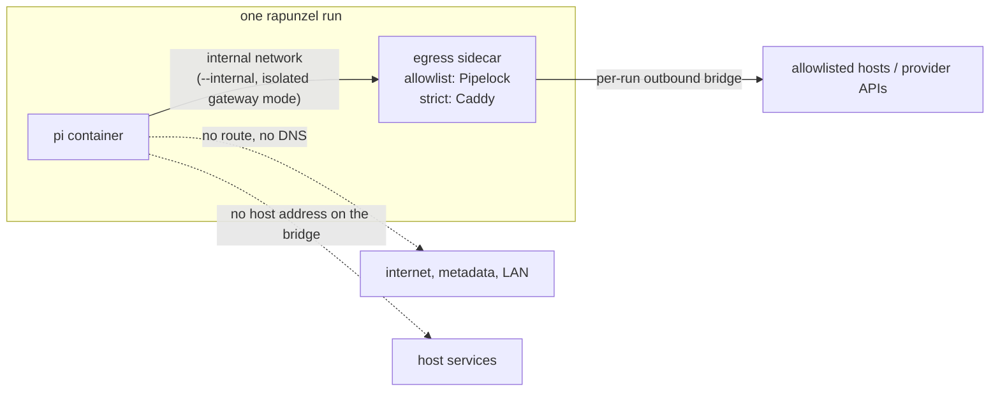

# Egress control: architecture and decisions

This document describes how rapunzel restricts the network access of the agent container, why it is built this way, and what it does not protect against.
For day-to-day use, see the [guide](guide.md#egress-control).

## Goal and threat model

The agent harness and everything it runs are treated as hostile.
A prompt-injected or misbehaving agent may try to send project data or credentials anywhere it can reach, probe the host and the local network, or persist changes that run later.
The agent's own sandboxing and permission prompts are not relied on: every control sits outside the agent container and is checked from outside.

Trusted: the host, the Docker engine, the launcher scripts, and the pinned sidecar images.
Untrusted: the agent process, every process it starts, the mounted project's content, and the agent's state volume.

## Modes

`RAPUNZEL_EGRESS` selects one of three modes.

| Mode | pi holds the provider credential | pi can reach | Use when |
|---|---|---|---|
| `open` (default) | yes | the internet through Docker's `bridge` network | compatibility; no egress control |
| `allowlist` | yes | only allowlisted hosts over HTTPS, through a CONNECT proxy | you want egress control and accept that pi sees its credential, including `/login` subscriptions |
| `strict` | no, only a placeholder | only fixed provider routes on a credential gateway | an API key must stay out of the sandbox |

## Architecture

Both restricted modes share the same network layout and differ only in the sidecar.

For every run, `lib/egress.sh`:

1. creates an internal network with `--internal` and `com.docker.network.bridge.gateway_mode_ipv4/ipv6=isolated`;
2. creates a separate outbound bridge with inter-container communication disabled;
3. starts the sidecar on the internal network under a fixed alias, connects it to the outbound bridge, and waits until it reports healthy;
4. starts pi on the internal network only;
5. removes the sidecar, its anonymous volume, and both networks when pi exits, also on failure.

The sidecars run read-only, as a non-root user, with all capabilities dropped (Caddy keeps `NET_BIND_SERVICE`, see [D6](#d6-caddy-for-strict-mode)), `no-new-privileges`, and pids and memory limits.
They have no bind mounts.

### allowlist mode

pi gets `HTTPS_PROXY` and `https_proxy` set to `http://egress:8888` and `NODE_USE_ENV_PROXY=1`, so Node's built-in `fetch` uses the proxy as well.
`HTTP_PROXY` is not set, so plain `http://` requests have no route and fail closed.

The allowlist is derived from the configuration:

| Configured | Allowed host |
|---|---|
| `ANTHROPIC_API_KEY` | `api.anthropic.com` |
| `OPENAI_API_KEY` | `api.openai.com` |
| `RAPUNZEL_API_BASE_URL` | that URL's host |
| `RAPUNZEL_EGRESS_LOGINS` | the model API and token refresh hosts of each named `/login` provider, see [D11](#d11-login-providers-are-named-on-the-host) |
| `RAPUNZEL_EGRESS_ALLOW` | each comma-separated host; `*.example.com` also matches `example.com` |
| `RAPUNZEL_EGRESS_ALLOW_PRIVATE` | each exact host, also written to Pipelock's `trusted_domains`, so it may resolve to a private address, see [D12](#d12-private-hosts-are-exact-and-explicit) |

The launcher renders a [Pipelock](https://github.com/luckyPipewrench/pipelock) config with:

- `mode: strict` and `api_allowlist`: only listed hosts are reachable;
- `forward_proxy.sni_verification` and `sni_require_tls`: the tunnel must start with a TLS ClientHello whose SNI equals the CONNECT host;
- Pipelock's default internal ranges: loopback, RFC 1918, CGNAT, link-local and cloud metadata, multicast, and IPv6 local ranges are refused after DNS resolution;
- `metrics_listen` on loopback, so `/metrics` and `/stats` are not reachable from pi;
- `idle_timeout_seconds: 900`, so long, quiet model turns are not cut off.

The proxy resolves names itself, and only after the allowlist check, so pi needs no DNS and a denied name never reaches a resolver.

### strict mode

pi gets a placeholder key, and the bootstrap points its providers at `http://llm-proxy:8080`.
Caddy holds the real keys and forwards three fixed routes, `/anthropic`, `/openai`, and `/custom`, always overwriting the auth headers.
Everything else gets `403`.
See the [guide](guide.md#strict-mode) for routes and limits.

## Decisions

### D1: Egress control through a sidecar on an internal network

**Decision.**
The network boundary is a Docker `--internal` network.
The only path out is a sidecar that is connected to two networks.

**Alternatives considered.**

- **Host firewall rules** (nftables, the `DOCKER-USER` chain): Linux only. On Docker Desktop the rules would live in a VM the user does not control, and WSL2 differs again.
- **iptables inside the agent container**, as in Anthropic's devcontainer: needs `NET_ADMIN` inside the untrusted container, and allowlists by IP, which shared CDN addresses defeat.
- **Transparent proxy**: needs routing changes in the agent's network namespace. An explicit proxy on an internal network gives the same fail-closed result.
- **`--network none` with a unix-socket bridge**: works, but needs a forwarder inside the agent container. Kept as a fallback idea for engines older than 28.
- **MicroVM sandboxes** (Docker Sandboxes, microsandbox, Gondolin): stronger isolation, but none covered Linux, WSL2, and macOS uniformly when this was evaluated. Docker Sandboxes is worth evaluating as a backend for other agents.

**Why.**
This is the only option that behaves the same on Linux, Docker Desktop for macOS, and WSL2.
It also fails closed: anything that ignores the proxy simply has no route.

### D2: Require isolated gateway mode (Docker Engine 28+)

**Decision.**
The internal network is created with isolated gateway mode, and the run aborts if the engine cannot create it.

**Why.**
A plain `--internal` network still gives the bridge an address on the host side.
In testing, a listener on the host network was reachable from a plain internal network (`CONNECTED`), but not from an isolated one.
Docker Engine 26 and later also no longer forward external DNS lookups from internal networks (CVE-2024-29018).

### D3: Per-run outbound network for the sidecar

**Decision.**
The sidecar's outbound side is a fresh bridge for each run, with `enable_icc=false`, instead of Docker's default bridge.

**Why.**
A compromised sidecar on the default bridge could reach the user's other containers there.

### D4: Pipelock as the allowlist proxy

**Decision.**
Use Pipelock 3.5.0, pinned by digest, in `mode: strict` with SNI verification and TLS required.

**Evidence.**
All candidates ran on an isolated internal network with only `api.openai.com` allowed:

| Candidate | Allowed host | Denied host, IP literal, metadata | SNI differs from CONNECT host |
|---|---|---|---|
| Squid 6.13 (`ubuntu/squid`) | works | refused | **bypassed**: reached `pastebin.com`, `discord.com` |
| Smokescreen | works | refused | **bypassed** |
| tinyproxy | works | refused | no SNI check at all |
| Pipelock 3.5.0 | works | refused | **refused**, and missing SNI is refused too |

A CONNECT allowlist that checks only the CONNECT hostname lets an agent open a tunnel to an allowed name on a shared CDN, then send a different SNI and reach any other site on that CDN.

**Costs and mitigations.**

- Pipelock is large (about 405k lines of Go, and release images include paid-tier code), so it is a big trust boundary. It runs with no capabilities, read-only, and as a non-root user, and every update is reviewed (see D9).
- It still dials non-443 ports on allowed hosts. Because TLS with a matching SNI is required, that can only reach a TLS service on an allowed host.
- It forwards plain-HTTP absolute-URI requests to allowed hosts. pi gets no `HTTP_PROXY`, so only a deliberate request does this, and only to an allowed host.

**Fallback.**
A purpose-built guard of about 200 lines of Go could replace Pipelock: CONNECT only, port 443 only, exact host match, SNI equal to the host, reject Encrypted Client Hello, reject non-global IPs, dial the address that was checked.
It is easier to audit but is code we would have to own.

### D5: pi holds its key in allowlist mode; strict mode stays available

**Decision.**
`allowlist` forwards provider keys to pi as `open` does.
`strict` keeps the credential gateway for setups where the key must not be in the sandbox.

**Why.**
The user decided that pi may know its LLM tokens.
That leaves one gap only the gateway closes: an allowed provider API can be used with an attacker's key to send data out.
One example is uploading files to the Anthropic Files API (the "Claude Pirate" technique).
A CONNECT proxy cannot see which key a request uses; the gateway overwrites it.

### D6: Caddy for strict mode

**Decision.**
Caddy, configured per run as a reverse proxy with fixed routes.

**Why.**

- It verifies upstream TLS and sets SNI by default. nginx and Envoy do not verify upstream certificates by default.
- It reads secrets through `{env.*}` at request time, so no rendered file contains them.
- One setting (`flush_interval -1`) gives unbuffered streaming.

Dedicated agent tools were tested against the same attack, an agent request carrying its own `Authorization` and `x-api-key`.
iron-proxy and Infisical agent-vault both let the agent's second auth header through by default.
Both also need a CA in the agent, and both sent the real key in cleartext when the agent asked for `http://`.
agentgateway fits on paper but brings a very large config surface.

The official Caddy binary has the `NET_BIND_SERVICE` file capability and does not execute without that capability in the bounding set, so the sidecar keeps it.

### D7: No `HTTP_PROXY` in allowlist mode

**Decision.**
Only `HTTPS_PROXY` and `https_proxy` are set.

**Why.**
Every allowed destination is an HTTPS API.
Leaving `HTTP_PROXY` unset means cleartext requests fail on the internal network instead of leaving through the proxy.

### D8: Config delivery without bind mounts

**Decision.**

- **Pipelock:** the config is copied with `docker cp` into an anonymous volume at `/config` before the container starts.
- **Caddy:** the config travels in an environment value, and a shell wrapper writes it to tmpfs.

**Why.**
The Pipelock image has no shell, and `docker cp` into a read-only root filesystem is refused.
Bind mounts would depend on Docker Desktop file sharing and would not work with remote Docker contexts.

### D9: Sidecar images pinned by digest, updated by hand

**Decision.**
Both images are pinned to a multi-arch index digest in `lib/egress.sh`.
Renovate proposes updates, and the sidecars never automerge.

**Why.**
The sidecar is the network boundary.
A tag can be moved; a digest cannot.

### D10: No package registries or GitHub by default

**Decision.**
Only the configured provider hosts are allowed.
Anything else needs `RAPUNZEL_EGRESS_ALLOW`.

**Why.**
Registries and GitHub accept uploads with any token: `npm publish`, gists, pushes.
Allowing them opens a path out as well as a source of injected content.
Install dependencies in `open` mode, or from a read-only mirror, before an `allowlist` session.

### D11: Login providers are named on the host

**Decision.**
`/login` (OAuth) subscriptions are supported in `allowlist` mode only, through `RAPUNZEL_EGRESS_LOGINS`.
Each name expands to fixed hosts in `lib/egress.sh`, taken from pi's provider code:

| `/login` provider (`RAPUNZEL_EGRESS_LOGINS`) | Allowed hosts |
|---|---|
| `openai` (ChatGPT subscription, "Sign in with ChatGPT") | `api.openai.com`, `auth.openai.com` |
| `openai-codex` (pi's legacy ChatGPT Plus/Pro login) | `chatgpt.com`, `auth.openai.com` |
| `anthropic` (Claude subscription) | `api.anthropic.com`, `platform.claude.com` |
| `github-copilot` | `api.github.com`, `*.githubcopilot.com` |

`strict` mode rejects login providers.

**Why.**
pi stores OAuth tokens in `auth.json` in the agent volume and refreshes them itself, so they are inside the sandbox in every mode.
A gateway could hold them only by owning the refresh flow.
That is fragile: OpenAI refresh tokens are single-use, and pi reads the account ID from the access token.

The allowlist is never derived from `auth.json`.
pi can write that file, so it could add a provider and widen its own allowlist for the next run.

### D12: Private hosts are exact and explicit

**Decision.**
`RAPUNZEL_EGRESS_ALLOW_PRIVATE` lists exact host names that may resolve to private addresses.
Each name goes into both `api_allowlist` and Pipelock's `trusted_domains`.
Wildcards are refused, and the setting exists only in `allowlist` mode.

**Why.**
A model router on the local network, such as OmniRoute at a `10.x` address, is a common setup.
Pipelock's SSRF protection refuses private destinations after DNS resolution, which is right by default: otherwise any allowlisted name could be pointed at the LAN or the host.
Trusting a name hands its DNS owner the choice of internal address, so the exception must be narrow and deliberate.
Cloud metadata and link-local ranges stay blocked; Pipelock does not let them be exempted.

`strict` mode needs no such setting: the Caddy gateway forwards only to its configured upstreams.

## Residual risks

Ranked by the security review:

1. **Host code execution through the project mount (critical).** pi can write files the host later runs, such as `.git/hooks`, `.git/config` (`core.fsmonitor`, `core.hooksPath`), `.vscode/tasks.json`, `.envrc`, package scripts, CI workflows, and agent hook settings. Running git or opening an IDE afterwards bypasses every network control. Partly mitigated: `.git/config`, `.git/hooks`, and an in-project `core.hooksPath` are mounted read-only, and `rapunzel` reports changes to other host-executed files after each run (see [Files the host runs](guide.md#files-the-host-runs)). Everything except git config and hooks is detected, not prevented.
2. **Data sent out through allowed hosts (high).** pi can send anything it reads to an allowed provider: under your key in `allowlist` mode, or under an attacker's key unless `strict` is used. The same applies to every host added with `RAPUNZEL_EGRESS_ALLOW` or `RAPUNZEL_EGRESS_LOGINS`. With a `/login` subscription, pi also holds a refresh token, which stays valid beyond the session if it leaks. Sign out (`/logout`) to revoke it after untrusted work.
3. **Encrypted Client Hello (medium, unverified).** With ECH, the outer SNI can name an allowed host while the inner one names another site on the same CDN. Pipelock has no ECH handling.
4. **Allowlist creep (medium).** Each added host widens the path out.
5. **Agent-volume tampering (medium).** Extensions, settings, and trust decisions persist in the agent volume and run again in the next session.
6. **Sidecar compromise (medium).** A compromised sidecar has full egress. The per-run outbound network limits it to the internet.
7. **Kernel or container escape (low likelihood, high impact).** On Linux this reaches the host; on Docker Desktop, the VM.

## Verification

`./verify-egress.sh` runs both restricted modes through the real launcher and fails on any missed check.
A listener on the host network acts as a canary.

- **Both modes:** no external DNS, no direct IPv4 or IPv6, no cloud metadata, and the host canary is unreachable through `host.docker.internal` and through the network's gateway address.
- **allowlist** (needs internet), run with `api.openai.com` allowed through `OPENAI_API_KEY`, with `chatgpt.com` through `RAPUNZEL_EGRESS_LOGINS=openai-codex`, and twice against a self-signed HTTPS server behind a `nip.io` name that resolves to a private address:
  - an allowed host works with `fetch` and through a raw tunnel;
  - other hosts are refused;
  - a mismatched SNI, a missing SNI, and plaintext inside a tunnel are refused;
  - IP literals, metadata, `host.docker.internal`, and plain `http://` are refused;
  - the proxy's `/stats` and `/fetch` endpoints expose nothing;
  - the private host is refused with only `RAPUNZEL_EGRESS_ALLOW`, and reachable with `RAPUNZEL_EGRESS_ALLOW_PRIVATE`.
- **strict** (offline; an echo server stands in for the provider):
  - the upstream is reachable only through the gateway;
  - the gateway answers unknown routes and unconfigured providers with `403`;
  - the gateway replaces the agent's credentials, and no real key reaches pi's environment or `models.json`;
  - the variables named by `RAPUNZEL_BASE_URL_VARIABLE` and `RAPUNZEL_API_KEY_VARIABLE` hold the gateway route and the placeholder.
- **Afterwards:** no sidecar container or network is left behind.

CI runs it on every pull request.
Tested on Docker Desktop 29 (macOS, arm64) and Docker Engine 28 (Ubuntu, CI); WSL2 is not yet tested.

## Next steps

1. Let pi work in a clone that the host fetches from, so changes are reviewed before they reach the host's working tree. Read-only git control files and the change report are in place.
2. Test on WSL2 (NAT networking).
3. Use scoped, spend-limited provider keys, and make the extensions directory read-only, managed through `rapunzel-ext`.
4. Add per-agent allowlist defaults when Claude Code, Codex, and Copilot are supported. Copilot needs `api.github.com`, which opens GitHub's write API, so it should be opt-in.
5. Evaluate Docker Sandboxes as a backend for agents other than pi.

## Sources

- [Pipelock configuration reference](https://github.com/luckyPipewrench/pipelock/blob/main/docs/configuration.md)
- [Stripe Smokescreen](https://github.com/stripe/smokescreen)
- [Squid security audit](https://megamansec.github.io/Squid-Security-Audit/)
- [Moby isolated gateway mode (PR #49262)](https://github.com/moby/moby/pull/49262)
- [CVE-2024-29018 advisory](https://github.com/moby/moby/security/advisories/GHSA-mq39-4gv4-mvpx)
- [Claude Pirate: data exfiltration through the Anthropic Files API](https://embracethered.com/blog/posts/2025/claude-abusing-network-access-and-anthropic-api-for-data-exfiltration/)
- [Docker Sandboxes architecture](https://docs.docker.com/ai/sandboxes/architecture/)
- [Claude Code network configuration](https://code.claude.com/docs/en/network-config)
- [GitHub Copilot allowlist reference](https://docs.github.com/en/copilot/reference/copilot-allowlist-reference)
